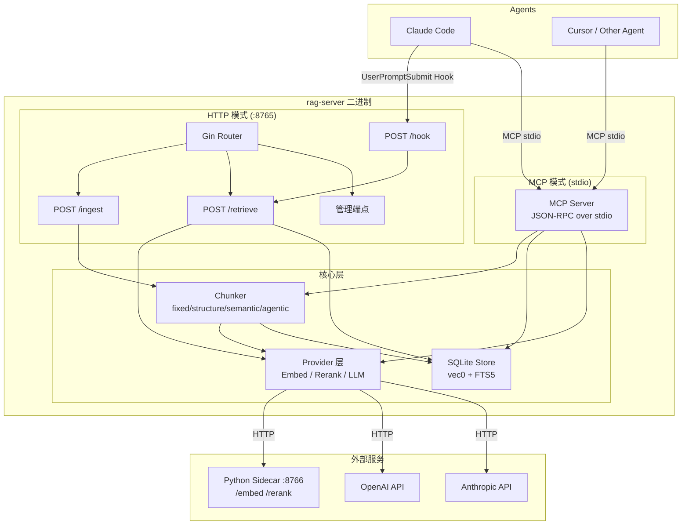
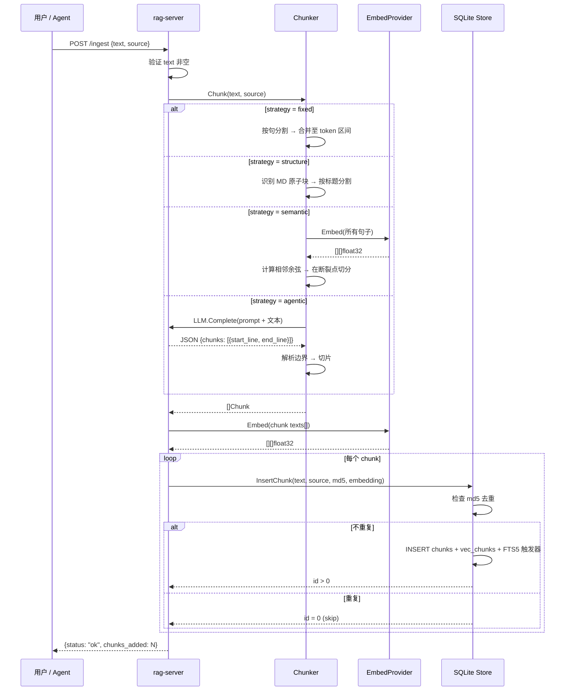
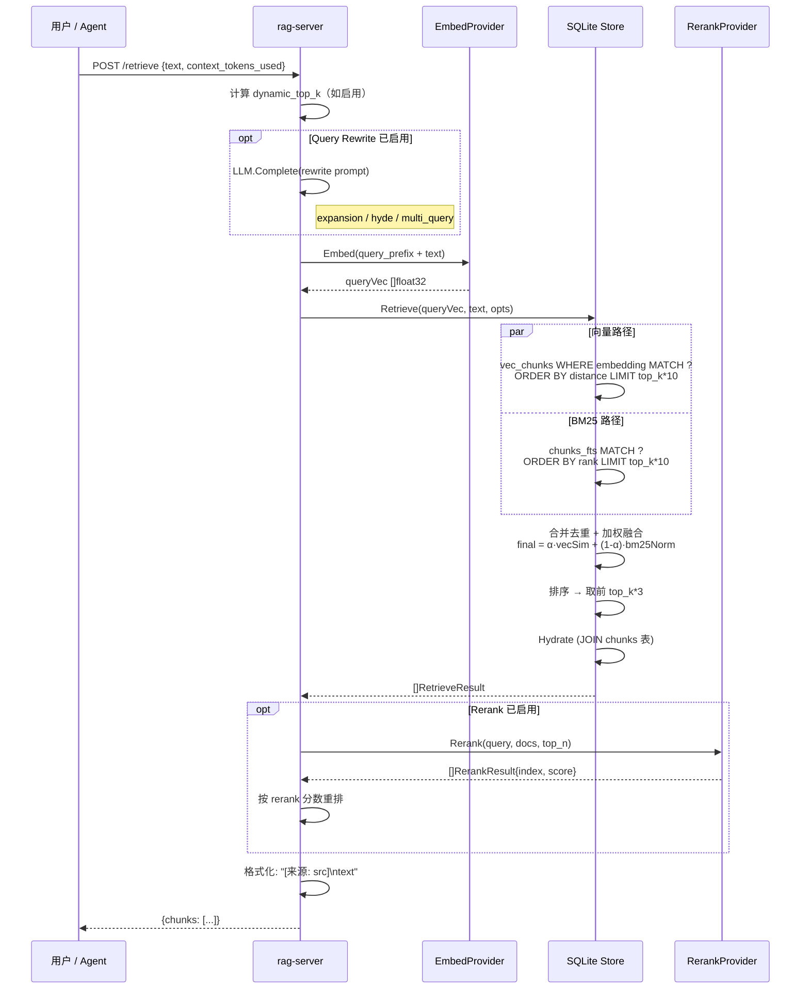
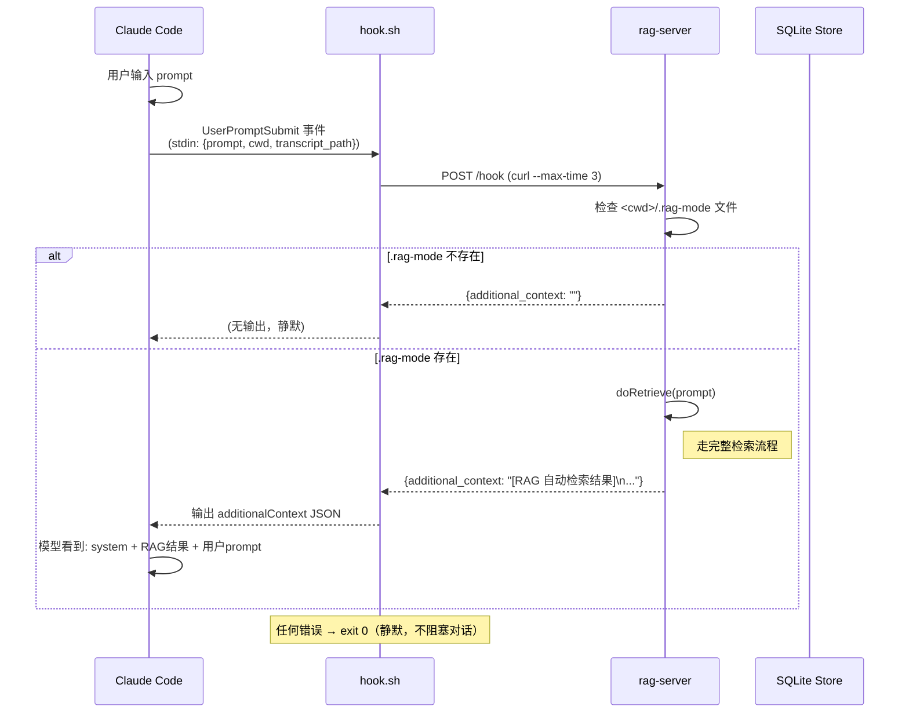
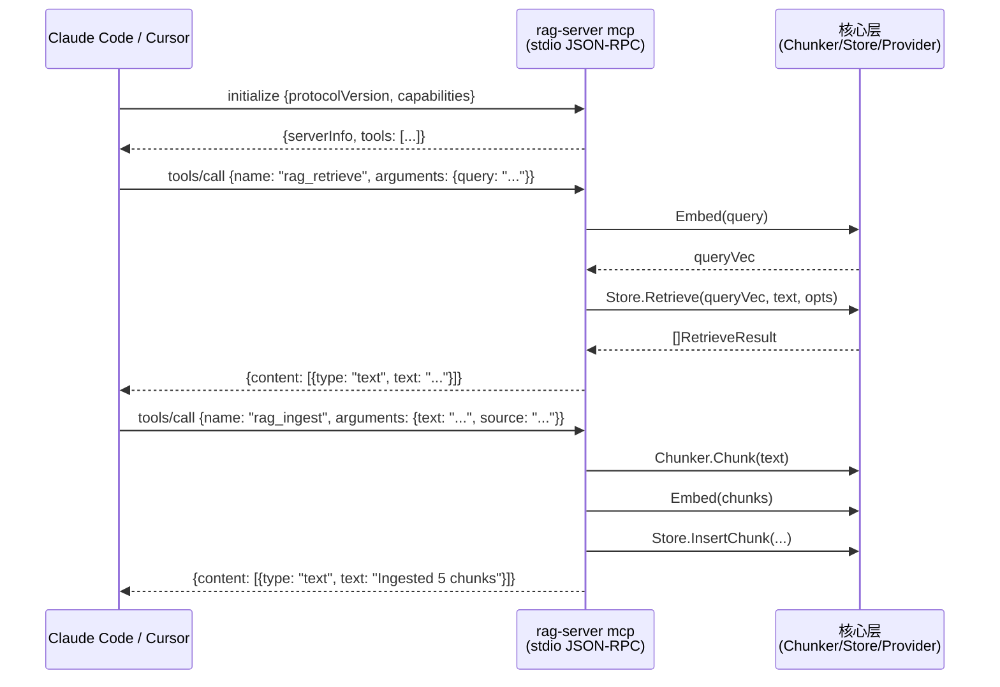
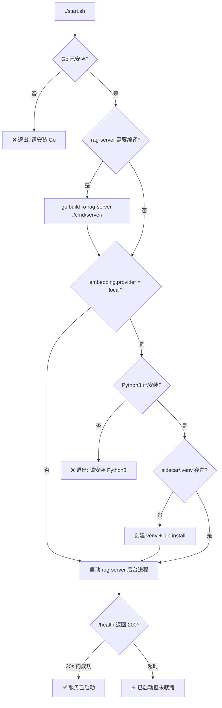
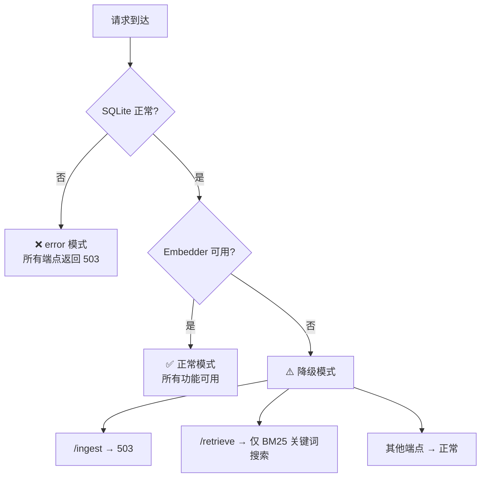
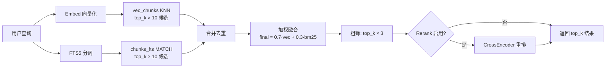

# Local RAG — 系统图

## 1. 系统架构总览



---

## 2. 入库时序图 (Ingest)



---

## 3. 检索时序图 (Retrieve)



---

## 4. Hook 自动检索时序图



---

## 5. MCP 调用时序图



---

## 6. 启动流程图



---

## 7. 服务内部启动流程图

```mermaid
flowchart TD
    MAIN[main()] --> LOAD_CFG[加载 config.yaml]
    LOAD_CFG --> CHECK_MODE{os.Args[1] == "mcp"?}

    CHECK_MODE -->|是| MCP_MODE
    CHECK_MODE -->|否| HTTP_MODE

    subgraph MCP_MODE[MCP 模式]
        M1[InitLogger error/text] --> M2[启动 Sidecar]
        M2 --> M3[初始化 Provider]
        M3 --> M4[初始化 Store]
        M4 --> M5[初始化 Chunker]
        M5 --> M6[注册 MCP Tools]
        M6 --> M7[server.Run StdioTransport<br/>阻塞等待客户端]
    end

    subgraph HTTP_MODE[HTTP 模式]
        H1[InitLogger] --> H2[启动 Sidecar]
        H2 --> H3[初始化 Provider]
        H3 --> H4[初始化 Store]
        H4 --> H5[初始化 Chunker]
        H5 --> H6[构建 Handler]
        H6 --> H7[注册 28 个 Gin 路由]
        H7 --> H8[监听 SIGINT/SIGTERM]
        H8 --> H9[r.Run :8765]
    end
```

---

## 8. Sidecar 生命周期流程图

```mermaid
flowchart TD
    START[Manager.Start] --> CHECK{provider == "local"?}
    CHECK -->|否| SKIP[跳过，不启动 sidecar]
    CHECK -->|是| SPAWN[启动 python3 sidecar/main.py --port 8766]

    SPAWN --> POLL{每 500ms 探活 /health}
    POLL -->|200 OK| READY[✅ Sidecar 就绪]
    POLL -->|超时 30s| FAIL[❌ 启动失败，kill 进程]

    READY --> LOOP[后台健康检查循环<br/>每 10s 探测一次]
    LOOP --> HEALTH_OK{/health 200?}
    HEALTH_OK -->|是| RESET_FAIL[failures = 0]
    HEALTH_OK -->|否| INC_FAIL[failures++]
    RESET_FAIL --> LOOP
    INC_FAIL --> TOO_MANY{failures >= 3?}
    TOO_MANY -->|否| LOOP
    TOO_MANY -->|是| RESTART[Kill + 重新 Start]
    RESTART --> SPAWN
```

---

## 9. 降级策略流程图



---

## 10. 混合检索评分流程图


